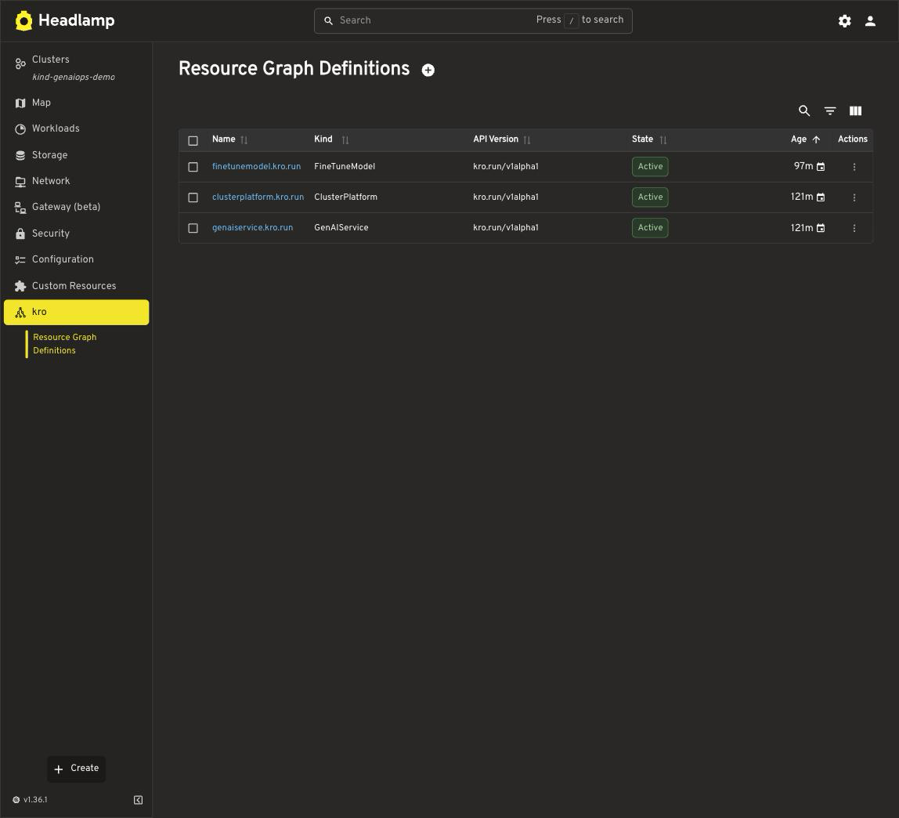
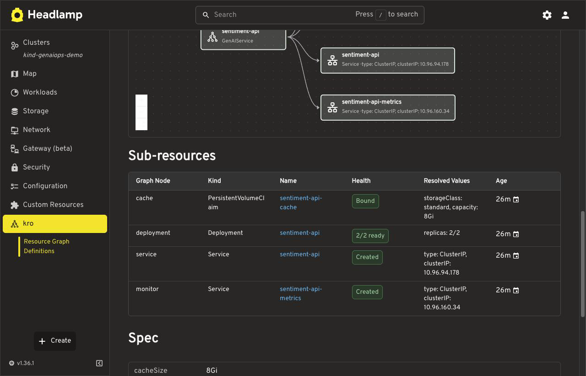
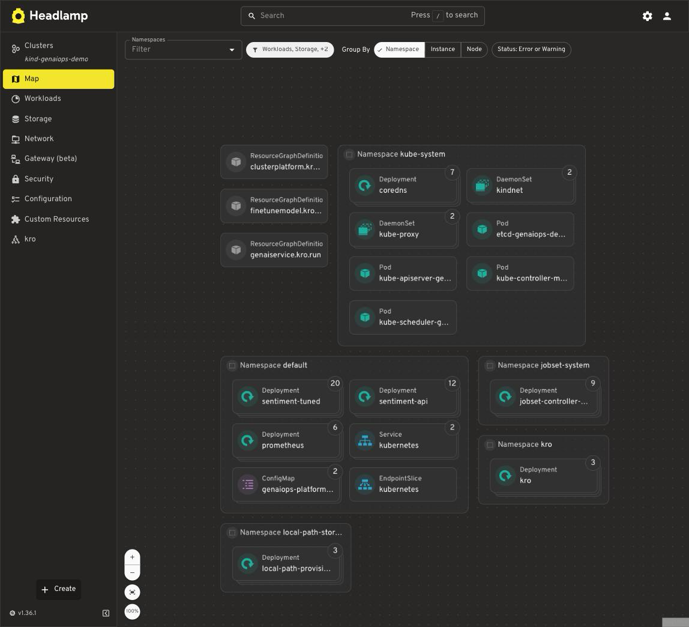
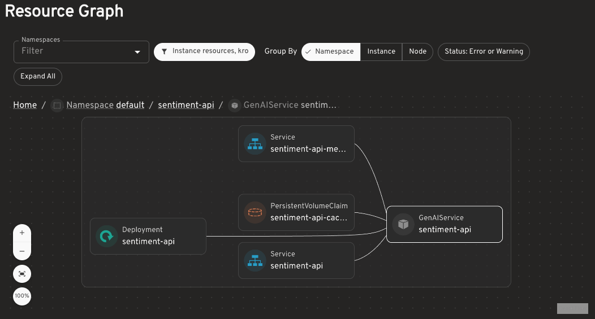

I built an alpha plugin for Headlamp, the open-source Kubernetes UI. It just had its first public release: **[kro Plugin for Headlamp, v0.1.0-alpha](https://github.com/headlamp-k8s/plugins/releases/tag/kro-0.1.0-alpha)**.

If you've adopted [kro](https://kro.run) (Kube Resource Orchestrator) to build simplified, portable APIs on top of Kubernetes, you've probably run into the same friction I did: kro's entire value proposition — the graph of resources it generates and reconciles on your behalf — only really exists in YAML and `kubectl` output. You define a `ResourceGraphDefinition`, kro turns it into a real CRD, and then... you're back to squinting at `kubectl get` and `describe` to understand what actually got created. The kro plugin for [Headlamp](https://headlamp.dev) closes that gap.

## The problem, in plain terms

kro lets platform teams define a simple, custom API — say, "give me a web app" — that developers can use without knowing anything about the Deployments, Services, and PVCs underneath. That's great for the people *consuming* the API. But someone still has to build and maintain the API itself, and today that means reading raw YAML to answer basic questions like:

- What does this API actually expand into?
- Did my instance reconcile correctly?
- Why is this resource using the wrong storage class in this cluster?

None of that is visible in a normal Kubernetes dashboard, because kro's resources don't look special to anything that doesn't already understand kro.

## What the plugin does

The plugin adds dedicated, live-updating views (no polling — it uses Kubernetes watches) for the three things you actually care about when working with kro:

**ResourceGraphDefinitions.** A list and detail view showing the generated API's kind and version, its state and conditions, and — this is the part I think is most useful — the composed resources laid out in kro's own topological order, with annotations for dependencies and external references. You can finally see the shape of the graph you defined, not just its YAML.

*Every RGD in the cluster, with the API it generates and whether kro has accepted it.*

On the detail page, that same graph shows up as a table of composed resources — each one's kind, API version, what it depends on, and whether it's conditional:

*Composed resources in kro's topological order, with external references marked read-only — alongside the simplified schema developers actually consume.*

**Instances.** For every active RGD, the plugin automatically discovers the generated CRD and builds a view for it — no configuration needed. New APIs just show up.

**Sub-resources with resolved values.** This is the one that sells the "portability" story kro is built around. Each resource an instance creates shows up with its health, a deep link to Headlamp's native page for it, and the *environment-resolved* values that actually matter — a PVC's real `storageClassName`, a Deployment's ready count, a Service's type and cluster IP. So if the same instance YAML produces a different storage class on cluster A versus cluster B, you see that difference right in the UI instead of having to diff `kubectl` output by hand.

*Health and resolved values per sub-resource — the storage class and cluster IPs here are what the cluster actually produced, not what the template asked for.*

There's also Map view integration (RGDs, instances, and their resources show up as nodes you can navigate), and a "New Instance" action that pre-fills Headlamp's YAML editor with a minimal valid instance based on the RGD's schema — useful for testing an API without hand-writing YAML from scratch.

*kro's RGDs as first-class nodes in Headlamp's Map, next to the workloads they ultimately produce.*

## Why this matters beyond convenience

If you care about kro because of its multi-cloud portability story — the same API definition working across kind, EKS, GKE, and AKS with cluster-specific values resolved underneath — visibility is the whole ballgame. It's one thing to claim portability works; it's another to point at a screen and show a platform engineer the exact StorageClass or Service type that got resolved differently per cluster. This plugin makes that argument concrete instead of theoretical.

## Update: embedded graphs have landed

When I first wrote this, the biggest rough edge was that per-RGD and per-instance graphs only existed in Headlamp's *global* Map view, not on the detail pages where you actually want them. That was blocked on Headlamp exposing its Map renderer to plugins — and that export has since landed in [headlamp#6992](https://github.com/kubernetes-sigs/headlamp/pull/6992).

The plugin now adopts it. The RGD detail page renders the template DAG, and the instance detail page renders the live resource graph, both inline:

*The template DAG, embedded directly on the RGD detail page — no trip to the global Map required.*

*The live resource graph for a single instance, on that instance's own page.*

On hosts newer than Headlamp 0.44.0 these use Headlamp's own GraphView, which means you get KubeIcons and the standard node details panel for free — click any node and the normal Headlamp detail drawer opens over the graph:

*Native node details, from the plugin's graph — the kro ownership labels the plugin uses for discovery are right there in the panel.*

Older hosts aren't left behind: Headlamp 0.44.0 and older automatically fall back to the plugin's own lightweight renderer, drawing the same graphs. No configuration, no version pinning — the plugin picks whichever is available.

This work is in flight as [plugins#1182](https://github.com/headlamp-k8s/plugins/pull/1182).

## What's still rough (it's alpha, after all)

The embedded graphs inherit some behavior from the Map view they're built on, which is visible when the native GraphView is in use:

- The Map chrome — source picker, namespace filter, grouping chips — renders above the graph, and other enabled Map sources can contribute related nodes. So the instance graph shows the instance in its wider kro context, including its RGD and sibling instances, rather than strictly the instance's own resources.
- Opening a page with an embedded graph resets Headlamp's global namespace filter, exactly as visiting the Map view does.
- Node selection adds `?node=` and `?group=` query parameters to the detail page URL and participates in browser history. Harmless to the plugin's routes, but it does mean the back button walks through node selections.

These are upstream behaviors of the exposed renderer rather than plugin bugs, and they're tracked in [headlamp#7242](https://github.com/kubernetes-sigs/headlamp/issues/7242), which requests an opt-in embedded mode that would turn the chrome off.

Separately, the Map view can occasionally get stuck loading on some clusters, due to a core Headlamp aggregation issue ([tracking issue](https://github.com/kubernetes-sigs/headlamp/issues/6555)) unrelated to this plugin specifically.

Feedback and bug reports are very welcome — this is a first public release, and the views and behavior will keep evolving before a 1.0.

## Try it

- Compatible with kro's `v1alpha1` APIs (verified against kro 0.9.2) and Headlamp >= 0.22, across desktop, in-cluster, web, and docker-desktop deployments
- [Release notes and install instructions](https://github.com/headlamp-k8s/plugins/releases/tag/kro-0.1.0-alpha)
- [Plugin PR #912](https://github.com/headlamp-k8s/plugins/pull/912) / [original proposal, #911](https://github.com/headlamp-k8s/plugins/issues/911)
- [kro.run](https://kro.run) if you haven't looked at kro itself yet

If you're running kro anywhere, I'd love to hear what's missing from this — especially which views you reach for most when debugging a broken reconciliation.

*If you're curious how the plugin actually pulls this off — discovering generated CRDs at runtime, reconstructing kro's dependency graph from status, and finding sub-resources with no owner references to lean on — I wrote up the technical internals in [a follow-up post](/blog/kro-headlamp-plugin-deep-dive/).*
